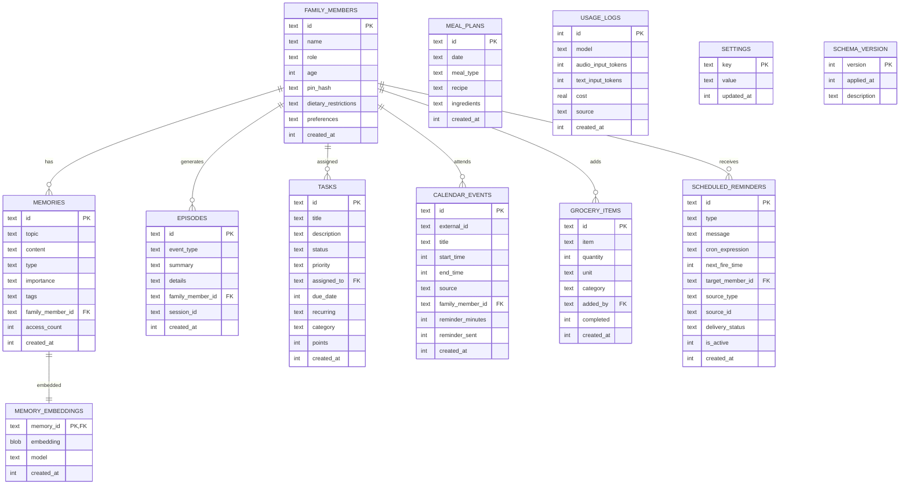

# Plan Addendum: Critical Gaps & Edge Cases

This addendum addresses the 101 gaps identified by SpecFlow analysis. Items are grouped by severity and include concrete solutions.

---

## CRITICAL FIXES (Must address before implementation)

### 1. PII in Voice Audio Pipeline

**Problem:** OpenAI Realtime API receives raw audio. PII is spoken before any redaction can happen. The text-based PII redactor only works AFTER transcription.

**Solution:** Accept this limitation for voice mode with these mitigations:
- Voice mode uses OpenAI directly (no Euri) - OpenAI's data policy doesn't use API data for training
- Add a disclaimer in settings: "Voice chat sends audio to OpenAI for transcription"
- For maximum privacy, offer a "text-only mode" that disables voice entirely
- PII redaction applies to text chat path (Euri API) where it IS effective
- Long-term: Investigate local whisper.cpp for on-device transcription (Phase 7)

**Files affected:** `src/components/settings-modal.tsx` (add privacy toggle)

### 2. Parent Profile Security (PIN Protection)

**Problem:** Name-based switching means children can switch to parent profiles.

**Solution:** Add optional PIN for parent profiles:
- Parent profiles can set a 4-digit PIN
- Child profiles: no PIN (just tap name)
- PIN only required for: switching TO parent profile, accessing settings, approving chores, modifying calendars
- PIN stored as bcrypt hash in `family_members.pin_hash` column
- Auto-timeout: Parent profile reverts to "no active user" after 30 min inactivity

**New DB column:** `family_members.pin_hash TEXT` (nullable - no PIN for children)
**Files affected:** `src/app/api/family/route.ts`, `src/components/family-switcher.tsx`

### 3. Reminder Delivery Multi-Channel Fallback

**Problem:** Single-channel push notifications can fail silently (permission revoked, DND mode).

**Solution:** Three-tier delivery with escalation:
1. **Web Push** (primary) - Fire notification
2. **In-App Alert** (fallback, always) - Persistent banner in app UI, survives page refresh
3. **Voice Announcement** (escalation) - If reminder unacknowledged after 5 min AND app is open, play TTS

**Acknowledgment states:** `pending` → `delivered` → `seen` → `acknowledged` → `acted_upon`

**New DB columns on `scheduled_reminders`:**
- `delivery_status TEXT DEFAULT 'pending'`
- `acknowledged_at INTEGER`
- `escalation_count INTEGER DEFAULT 0`

### 4. Database Migration with Transaction Safety

**Problem:** Partial migration could leave system in broken state.

**Solution:**
- Wrap entire migration in a single SQLite transaction (`BEGIN IMMEDIATE ... COMMIT`)
- If any step fails, `ROLLBACK` - JSON files remain as source of truth
- Add `schema_version` table to track migration state
- Migration is idempotent: running it again skips already-migrated tables
- Pre-migration: Copy JSON files to `backups/` directory with timestamp

```sql
CREATE TABLE schema_version (
  version INTEGER PRIMARY KEY,
  applied_at INTEGER DEFAULT (unixepoch()),
  description TEXT
);
```

### 5. Third-Party PII Detection (Beyond Family Members)

**Problem:** Regex only catches family names loaded from DB. Doctor names, neighbor addresses, friend phone numbers leak.

**Solution:** Hybrid approach:
- **Layer 1:** Family names from DB (exact match, highest confidence)
- **Layer 2:** Standard regex patterns for: phone numbers, email addresses, street addresses, SSN-like patterns, credit card numbers
- **Layer 3:** Common name detection using a lightweight first-name dictionary (~5000 common names, ~50KB)
- **Layer 4:** Context-aware heuristics: "Dr. [Word]", "my friend [Word]", "[Word] lives at"
- Accept that some PII will slip through (no system is 100%). Log detected PII counts for audit.

### 6. Calendar Sync Conflict Resolution

**Problem:** Local edits vs Google Calendar edits can conflict.

**Solution:** Google Calendar is source of truth (server wins):
- Local-created events get a `local_only` flag until successfully synced to Google
- On sync conflict: Google version wins, local change logged as episodic event
- User notified: "Your change to [event] was overridden by a change in Google Calendar"
- For locally-created events not yet synced: retry with exponential backoff

### 7. COPPA Considerations

**Problem:** Children under 13 have special privacy protections.

**Solution:** Since this runs entirely on a home network with parent control:
- All data stored locally (no cloud data collection beyond LLM API calls)
- Parents explicitly set up children's profiles (verifiable parental consent)
- Children's data never sent to cloud (PII redacted for text, voice acknowledged)
- No third-party analytics or tracking
- Add a "Data Privacy" section in settings showing exactly what goes where
- Export/delete all data per family member on request

---

## HIGH PRIORITY FIXES

### 8. Session Timeout & Auto-Lock

**Solution:**
- Parent profiles auto-lock after 30 min of inactivity
- Child profiles never auto-lock (low risk)
- "No active user" state shows family member picker
- Active session stored in `settings` table (survives page refresh)

### 9. Multiple Google Calendar Accounts

**Solution for MVP:** Single family calendar (shared Google Calendar).
- One OAuth connection per household
- Use a shared family calendar (not individual work calendars)
- Parent can select which calendar to sync from Google's calendar list

**Phase 2:** Multiple calendar support with per-member calendar associations.

### 10. Offline Feature Matrix

| Feature | Offline | Notes |
|---------|---------|-------|
| View grocery list | Yes | Cached in service worker |
| Add grocery item | Yes | Queued, syncs on reconnect |
| View calendar (cached) | Yes | Last-synced data |
| Create calendar event | No | Requires Google API |
| Voice chat | No | Requires OpenAI API |
| Text chat | No | Requires Euri API |
| View tasks | Yes | Cached |
| Create task | Yes | Queued |
| View dashboard | Yes | Cached data |
| Reminders | Partial | In-app only, no push |

### 11. Database Encryption

**Solution for MVP:** No encryption (home machine, physical security assumed).
**Phase 2:** Evaluate SQLCipher if device is a shared/portable device.
**Rationale:** SQLCipher adds ~2x read overhead and significant complexity. For a home server on a private network, physical security is the primary protection.

### 12. Grocery Item Deduplication

**Solution:**
- Normalize: lowercase, trim whitespace, singularize
- Fuzzy match: If normalized item is substring of existing item OR vice versa, prompt: "Did you mean [existing item]? Or add as new?"
- Quantity merge: If exact match, add quantities: "milk (2) + milk (1) = milk (3)"
- Category auto-detection: Simple keyword mapping (`milk → dairy`, `apple → produce`, `chicken → meat`)

### 13. Multi-Child Activity Conflict Detection

**Solution:**
- On activity creation, check for overlapping activities across siblings
- If conflict found: "Emma has soccer 4-5pm and Noah has piano 4-5pm on Tuesday. Both need pickup. Is this correct?"
- Store conflict acknowledgment so it doesn't re-alert

### 14. Voice Transcription Error Confirmation

**Solution for critical operations:**
- For tasks, grocery items, calendar events created via voice: Show confirmation in UI
- "I heard 'add bandanas to grocery list.' Is that correct?" (voice response)
- For casual conversation: No confirmation needed
- Text chat: No issue (user types exactly what they mean)

### 15. Recurring Event Disambiguation

**Solution:**
- When user says "cancel soccer practice": Ask "Just this week, or all future sessions?"
- Default to single instance if ambiguous
- Voice: "I'll cancel this week's soccer practice. Say 'cancel all' to cancel the series."
- Text: Show two buttons in response

---

## MEDIUM PRIORITY IMPROVEMENTS

### 16. Schema Version Management

Add migration framework:
```typescript
// src/lib/db.ts
const MIGRATIONS = [
  { version: 1, description: 'Initial schema', sql: INITIAL_SCHEMA },
  { version: 2, description: 'Add chore points', sql: 'ALTER TABLE tasks ADD COLUMN points INTEGER DEFAULT 0' },
  // Future migrations added here
];

function runMigrations(db: Database) {
  const currentVersion = db.prepare('SELECT MAX(version) as v FROM schema_version').get()?.v || 0;
  for (const migration of MIGRATIONS.filter(m => m.version > currentVersion)) {
    db.transaction(() => {
      db.exec(migration.sql);
      db.prepare('INSERT INTO schema_version (version, description) VALUES (?, ?)').run(migration.version, migration.description);
    })();
  }
}
```

### 17. Token Budget Enforcement

Hard limits per LLM call:
```
System prompt base:     400 tokens (fixed)
Family context:          50 tokens (always)
Relevant memories:      300 tokens (max 8 entries)
Calendar context:       200 tokens (only when relevant)
Chat history:           400 tokens (last N messages, summarize older)
User message:           200 tokens (truncate if longer)
---
TOTAL BUDGET:         1,550 tokens input max
```

If budget exceeded, trim in order: chat history → calendar → memories → never trim system prompt.

### 18. Database Backup Strategy

- Auto-backup: Copy `.db` file daily to `backups/jarvis-YYYY-MM-DD.db`
- Keep last 7 daily backups
- On-demand: `/api/backup` endpoint returns `.db` file download
- Backup runs at 3am via scheduler

### 19. Dashboard Empty States

First-run experience:
1. "Welcome to Jarvis! Let's set up your family." → Family setup wizard
2. After family setup: "Connect your Google Calendar?" → OAuth flow
3. Dashboard shows friendly empty states: "No tasks yet. Try saying 'Add a task to buy groceries'"

### 20. Chore Verification Flow

- Parent receives push notification: "[Emma] says she cleaned her room. Approve?"
- Options: Approve (award points) | Reject (reason) | Later (snooze 2hr)
- Auto-approve after 24 hours if no response (configurable)
- Points awarded immediately on approval

### 21. Meal Plan Dietary Restrictions

- `family_members.dietary_restrictions TEXT` (JSON array: `["peanut_allergy", "vegetarian"]`)
- When adding meal: Check ingredients against restrictions
- Warning: "This recipe contains peanuts. Noah has a peanut allergy."
- Not a hard block (parent can override), just a warning

---

## TOKEN & PERFORMANCE OPTIMIZATION DETAILS

### Context Injection Decision Tree

```
User message received
  │
  ├─ Contains calendar keywords? (schedule, event, tomorrow, today, appointment, class)
  │   └─ YES: Inject Level 2 (today's calendar, upcoming 24hr events)
  │
  ├─ Contains task/chore keywords? (task, chore, todo, remind, homework)
  │   └─ YES: Inject pending tasks for active family member
  │
  ├─ Contains grocery/meal keywords? (grocery, shopping, dinner, cook, recipe)
  │   └─ YES: Inject grocery list + today's meal plan
  │
  ├─ Contains memory keywords? (remember, last time, what do you know, history)
  │   └─ YES: Inject Level 3 (semantic search results)
  │
  └─ DEFAULT: Inject Level 0 only (family names + active user, ~50 tokens)
```

**Estimated savings vs current approach:**
- Current: ~500-800 tokens of memory context on EVERY call
- New: ~50-400 tokens, average ~150 tokens
- **60-80% reduction in input tokens per call**

### Model Routing for Cost Optimization

| Query Type | Model | Why |
|-----------|-------|-----|
| Simple greeting/chitchat | `gemini-2.5-flash-lite` | Ultra-fast, cheapest |
| Task/grocery CRUD | `gemini-2.5-flash` | Fast, reliable for structured ops |
| Complex reasoning/advice | `gemini-2.5-pro` | Smarter, worth the tokens |
| Voice | `gpt-4o-mini-realtime` | Only option for real-time voice |

Auto-detection: If message is < 10 words and matches common patterns (greeting, simple question), route to lite model. Otherwise use default.

### Embedding Generation Strategy

- Generate embeddings ASYNC (background worker, not blocking API response)
- Queue: New memory → add to embedding queue → worker processes queue
- Batch: Process up to 10 embeddings per API call (Euri supports batch)
- Cache: Never re-embed unchanged content (hash content, skip if same)
- Fallback: If embedding fails, memory still works with keyword search

---

## COMPLETE NEW TOOL DEFINITIONS (Voice + Text)

These 7 new tools are added alongside the existing 3 (save_memory, recall_memory, manage_task):

```json
[
  {
    "name": "manage_grocery",
    "description": "Manage the family grocery list. Add items, mark as bought, list items, or clear completed.",
    "parameters": {
      "action": { "type": "string", "enum": ["add", "complete", "list", "remove", "clear_completed"] },
      "item": { "type": "string", "description": "Item name (for add/complete/remove)" },
      "quantity": { "type": "integer", "description": "Quantity to add (default 1)" },
      "category": { "type": "string", "description": "Category: produce, dairy, meat, pantry, frozen, household" }
    }
  },
  {
    "name": "get_calendar",
    "description": "Get calendar events. Use when user asks about schedule, appointments, or 'what's today/tomorrow'.",
    "parameters": {
      "date": { "type": "string", "description": "Date to query (today, tomorrow, YYYY-MM-DD, or 'this week')" },
      "family_member": { "type": "string", "description": "Filter by family member name (optional)" }
    }
  },
  {
    "name": "create_event",
    "description": "Create a new calendar event. Use when user wants to schedule something.",
    "parameters": {
      "title": { "type": "string", "description": "Event title" },
      "date": { "type": "string", "description": "Date (YYYY-MM-DD or natural like 'next Tuesday')" },
      "time": { "type": "string", "description": "Start time (HH:MM or natural like '3pm')" },
      "duration_minutes": { "type": "integer", "description": "Duration in minutes (default 60)" },
      "family_member": { "type": "string", "description": "Who this is for (optional)" },
      "reminder_minutes": { "type": "integer", "description": "Remind X minutes before (default 15)" }
    }
  },
  {
    "name": "manage_activity",
    "description": "Manage kids' recurring activities (school, sports, classes). Create, list, or cancel activities.",
    "parameters": {
      "action": { "type": "string", "enum": ["create", "list", "cancel", "cancel_once"] },
      "child_name": { "type": "string", "description": "Child's name" },
      "activity": { "type": "string", "description": "Activity name" },
      "days": { "type": "string", "description": "Days of week (Mon,Wed,Fri)" },
      "time": { "type": "string", "description": "Start time (HH:MM)" },
      "duration_minutes": { "type": "integer", "description": "Duration" },
      "location": { "type": "string", "description": "Location (optional)" }
    }
  },
  {
    "name": "manage_chore",
    "description": "Assign, complete, or list chores for family members.",
    "parameters": {
      "action": { "type": "string", "enum": ["assign", "complete", "list", "verify"] },
      "chore": { "type": "string", "description": "Chore description" },
      "assigned_to": { "type": "string", "description": "Family member name" },
      "points": { "type": "integer", "description": "Points to award (for assign)" },
      "recurring": { "type": "string", "description": "daily, weekly, or none" }
    }
  },
  {
    "name": "set_reminder",
    "description": "Set a reminder or alarm. Use when user says 'remind me', 'set alarm', or 'wake me up'.",
    "parameters": {
      "message": { "type": "string", "description": "Reminder message" },
      "time": { "type": "string", "description": "When to remind (HH:MM, 'in 30 minutes', 'tomorrow 8am')" },
      "recurring": { "type": "string", "description": "Recurrence: daily, weekdays, weekly, or none" },
      "for_member": { "type": "string", "description": "Who to remind (optional, default: active user)" }
    }
  },
  {
    "name": "manage_meals",
    "description": "Plan meals for the week. Add, list, or query meal plans.",
    "parameters": {
      "action": { "type": "string", "enum": ["plan", "list", "whats_for"] },
      "date": { "type": "string", "description": "Date (YYYY-MM-DD, today, tomorrow)" },
      "meal_type": { "type": "string", "enum": ["breakfast", "lunch", "dinner", "snack"] },
      "recipe": { "type": "string", "description": "Meal name/recipe" },
      "add_to_grocery": { "type": "boolean", "description": "Auto-add ingredients to grocery list" }
    }
  }
]
```

**Total tools:** 10 (3 existing + 7 new)
**Tool schema token cost:** ~600 tokens (one-time per session in system prompt)

---

## ERD (Entity Relationship Diagram)



---

## Final Implementation Checklist

### Phase 1 - Week 1-2 (Foundation)
- [ ] `src/lib/db.ts` - SQLite init with schema, migrations, WAL mode
- [ ] Migrate `memory.ts` MemoryStore → SQLite
- [ ] Migrate `memory.ts` TaskStore → SQLite
- [ ] Migrate `usage/route.ts` → SQLite
- [ ] `src/lib/pii-redactor.ts` - Regex + family names + standard patterns
- [ ] Integrate PII redactor into `/api/chat/route.ts`
- [ ] Integrate PII redactor into `/api/ai/realtime-token/route.ts` (system prompt only)
- [ ] Add tool calling loop to `/api/chat/route.ts`
- [ ] JSON → SQLite one-time migration with backup
- [ ] Schema version tracking

### Phase 2 - Week 3-4 (Family + Calendar)
- [ ] `family_members` table + API + setup wizard
- [ ] Parent PIN protection
- [ ] Family member switcher in header
- [ ] Per-member memory context
- [ ] Google Calendar OAuth via next-auth
- [ ] Calendar sync engine (pull every 15 min)
- [ ] Calendar event local cache
- [ ] `get_calendar` and `create_event` tools
- [ ] `node-schedule` scheduler with SQLite persistence
- [ ] Reminder multi-channel delivery (push + in-app + voice)
- [ ] Tiered context injection (token optimization)
- [ ] Keyword-based context routing

### Phase 3 - Week 5-6 (Household)
- [ ] Grocery list CRUD + tool + deduplication
- [ ] Kids activity tracker with recurrence
- [ ] Multi-child conflict detection
- [ ] Chore assignment + points + verification
- [ ] Meal planning + grocery export
- [ ] Voice confirmation for critical operations
- [ ] Recurring event disambiguation ("just this week or all?")

### Phase 4 - Week 7-8 (Intelligence)
- [ ] Embedding generation via Euri (async, background)
- [ ] `sqlite-vec` integration for vector search
- [ ] Hybrid scoring: vector similarity + keyword + importance + recency
- [ ] Episodic memory logging (conversation summaries, events)
- [ ] Pattern detection (weekly patterns, seasonal)
- [ ] Smart context builder (embed query → find relevant memories)
- [ ] Model routing (lite for simple, pro for complex)

### Phase 5 - Week 9-10 (UI + PWA)
- [ ] Dashboard page with widgets
- [ ] Calendar widget
- [ ] Task/chore widget
- [ ] Grocery widget
- [ ] Meal plan widget
- [ ] PWA manifest + service worker
- [ ] Web push notification setup
- [ ] Offline caching (grocery list, calendar, tasks)
- [ ] Empty state guidance + onboarding
- [ ] Response streaming for text chat
- [ ] Daily auto-backup to `backups/` directory
- [ ] Morning briefing scheduled announcement
